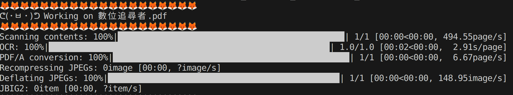

# OCR-Wizard

A powerful and user-friendly tool based on [OCRmyPDF](https://github.com/ocrmypdf/OCRmyPDF), offering a seamless graphical user interface for effortless conversion of image-based PDFs into searchable  text.

## Environment 
#### Step1. Install OCRmyPDF and tesseract languages

For Debian, Ubuntu users, you can simply use the following commands
```bash
# Install OCRmyPDF
sudo apt install ocrmypdf

# Install required tesseract languages
sudo apt-get install tesseract-ocr-chi-tra tesseract-ocr-chi-sim tesseract-ocr-jpn tesseract-ocr-deu tesseract-ocr-spa 
```

For Windows users, you can access a comprehensive walkthrough by clicking [here](./WindowsEnv.md).

If you are using other operating system, please consult the [official documentation](https://ocrmypdf.readthedocs.io/en/latest/installation.html) for detailed installation instructions.


#### Step2. Install required packages
Use the package manager [pip](https://pip.pypa.io/en/stable/) to install required packages
```bash!
pip install -r requirements.txt
```

## Usage
#### Step1. Run `main.py`
```bash
python3 main.py
```
An graphical user interface should appear. 


#### Step2. Select the PDF File 
<p align="center">
    
</p>

Press the "Select File" button and select the file you want to OCR. (it can be one or more files)

#### Step3. Select the Languages
<p align="center">
    
</p>
Select the languages in the document.

#### Step4. Start OCR
Press the "Start OCR" button and the OCR process will begin. You can monitor the progress in the termial.
<p align="center">
    
</p>

#### Step5. Continue or Exit 
<p align="center">
    
</p>
After the OCR process ends, you can choose to continue OCR other files by pressing the "Continue OCR" button or end the program by by pressing "Close" button. 

## Contributing

Pull requests are welcome. For major changes, please open an issue first to discuss what you would like to change.
